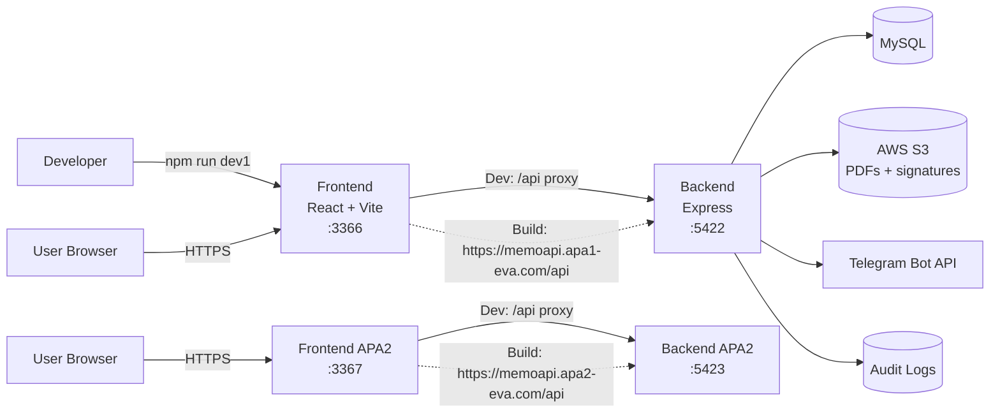
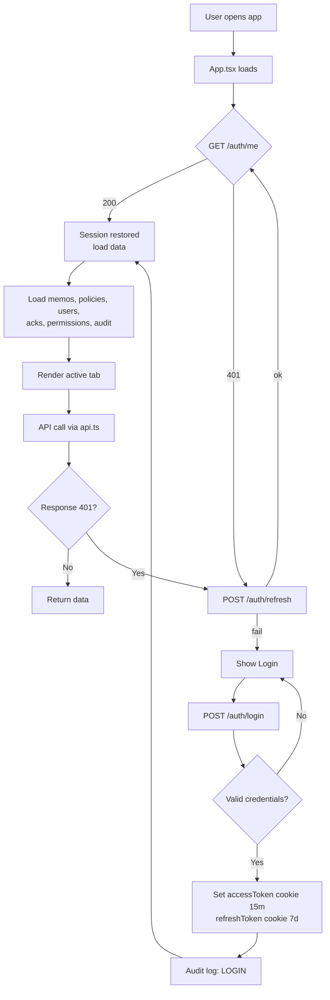
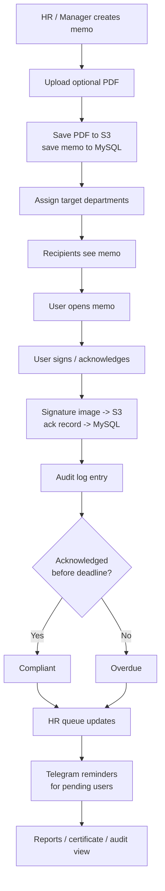
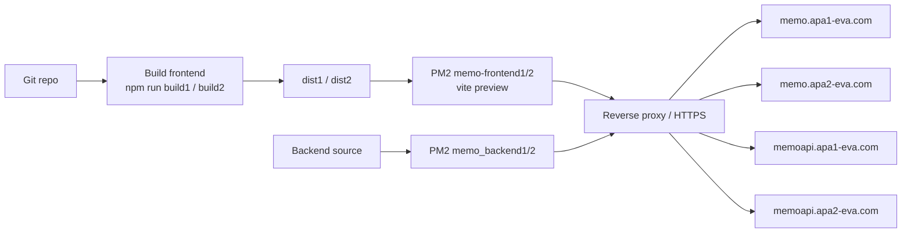

# Flowcharts — Memo Verifier

## 1. System architecture

```mermaid
flowchart LR
    Dev[Developer] -->|npm run dev1| FE[Frontend<br/>React + Vite<br/>:3366]
    Browser[User Browser] -->|HTTPS| FE
    User2[User Browser] -->|HTTPS| FE2[Frontend APA2<br/>:3367]

    FE -->|Dev: /api proxy| BE[Backend<br/>Express<br/>:5422]
    FE2 -->|Dev: /api proxy| BE2[Backend APA2<br/>:5423]

    FE -.->|Build: https://memoapi.apa1-eva.com/api| BE
    FE2 -.->|Build: https://memoapi.apa2-eva.com/api| BE2

    BE --> DB[(MySQL)]
    BE --> S3[(AWS S3<br/>PDFs + signatures)]
    BE --> TG[Telegram Bot API]
    BE --> AUD[(Audit Logs)]
```

## 2. Request and authentication flow

```mermaid
flowchart TD
    A[User opens app] --> B[App.tsx loads]
    B --> C{GET /auth/me}
    C -->|200| D[Session restored<br/>load data]
    C -->|401| E[POST /auth/refresh]
    E -->|ok| C
    E -->|fail| F[Show Login]
    F --> G[POST /auth/login]
    G --> H{Valid credentials?}
    H -->|No| F
    H -->|Yes| I[Set accessToken cookie 15m<br/>refreshToken cookie 7d]
    I --> J[Audit log: LOGIN]
    J --> D
    D --> K[Load memos, policies, users,<br/>acks, permissions, audit]
    K --> L[Render active tab]

    L --> M[API call via api.ts]
    M --> N{Response 401?}
    N -->|No| O[Return data]
    N -->|Yes| E
```

## 3. Memo lifecycle

```mermaid
flowchart TD
    A[HR / Manager creates memo] --> B[Upload optional PDF]
    B --> C[Save PDF to S3<br/>save memo to MySQL]
    C --> D[Assign target departments]
    D --> E[Recipients see memo]
    E --> F[User opens memo]
    F --> G[User signs / acknowledges]
    G --> H[Signature image -> S3<br/>ack record -> MySQL]
    H --> I[Audit log entry]
    I --> J{Acknowledged<br/>before deadline?}
    J -->|Yes| K[Compliant]
    J -->|No| L[Overdue]
    K --> M[HR queue updates]
    L --> M
    M --> N[Telegram reminders<br/>for pending users]
    N --> O[Reports / certificate / audit view]
```

## 4. Deployment (production)

```mermaid
flowchart LR
    Repo[Git repo] --> Build[Build frontend<br/>npm run build1 / build2]
    Build --> Dist[dist1 / dist2]
    Dist --> PM2F[PM2 memo-frontend1/2<br/>vite preview]
    Backend[Backend source] --> PM2B[PM2 memo_backend1/2]
    PM2F --> Proxy[Reverse proxy / HTTPS]
    PM2B --> Proxy
    Proxy --> Domain1[memo.apa1-eva.com]
    Proxy --> Domain2[memo.apa2-eva.com]
    Proxy --> Api1[memoapi.apa1-eva.com]
    Proxy --> Api2[memoapi.apa2-eva.com]
```
